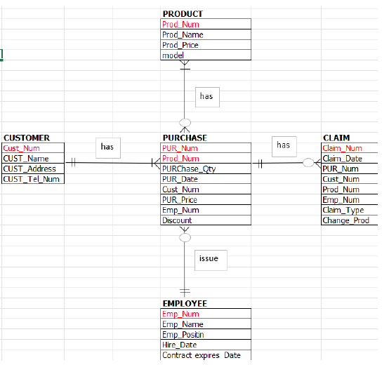

# MySQL Database Management System | Samsung Purchase & Claim Management System 


---

## 1. เกี่ยวกับโปรเจกต์ (Project Overview)
โปรเจกต์นี้เป็นการนำทฤษฎีการจัดการฐานข้อมูลมาประยุกต์ใช้ในสถานการณ์จริง โดยออกแบบระบบเพื่อจัดเก็บข้อมูล 5 ส่วนหลัก:
* **การจัดการสินค้า:** ติดตามรหัสสินค้า ราคา และรุ่น
* **ข้อมูลลูกค้า:** เก็บประวัติผู้ซื้อและช่องทางการติดต่อ
* **ข้อมูลบุคลากร:** จัดการสัญญาจ้างพนักงานและนักศึกษาฝึกงาน
* **การขายสินค้า:** บันทึกรายการสั่งซื้อ จำนวน และส่วนลด
* **การเคลมสินค้า:** ติดตามสถานะและสาเหตุการเคลมสินค้าที่มีปัญหา

### 📊 ER Diagram

---

## 2. โครงสร้างฐานข้อมูล (Database Schema)
ในโปรเจกต์นี้ประกอบด้วยตารางทั้งหมด 5 ตารางที่มีความสัมพันธ์กัน:

### ตารางสินค้า (Product)
| คอลัมน์ | ประเภทข้อมูล | คำอธิบาย |
| :--- | :--- | :--- |
| `prod_Num` | VARCHAR(4) | รหัสสินค้า (PK) |
| `Prod_name` | CHAR(15) | ชื่อสินค้า |
| `Prod_Price` | INT(5) | ราคาสินค้า |
| `model` | VARCHAR(28) | รุ่นของสินค้า |

### ตารางลูกค้า (Customer)
| คอลัมน์ | ประเภทข้อมูล | คำอธิบาย |
| :--- | :--- | :--- |
| `Cust_num` | VARCHAR(4) | รหัสลูกค้า (PK) |
| `Cust_Name` | CHAR(60) | ชื่อ-นามสกุลลูกค้า |
| `Cust_Address` | CHAR(100) | ที่อยู่จัดส่ง |
| `Cust_tel_num` | INT(10) | เบอร์โทรศัพท์ |

### ตารางพนักงาน (Employee)
| คอลัมน์ | ประเภทข้อมูล | คำอธิบาย |
| :--- | :--- | :--- |
| `emp_num` | VARCHAR(4) | รหัสพนักงาน (PK) |
| `emp_name` | CHAR(18) | ชื่อพนักงาน |
| `emp_position` | CHAR(10) | ตำแหน่งงาน |
| `Hire_Date` | DATE | วันที่เริ่มงาน |
| `Contract_expires_date` | DATE | วันสิ้นสุดสัญญา |

### ตารางการสั่งซื้อ (Purchase)
| คอลัมน์ | ประเภทข้อมูล | คำอธิบาย |
| :--- | :--- | :--- |
| `PUR_Num` | VARCHAR(4) | รหัสการสั่งซื้อ (PK) |
| `Prod_Num` | VARCHAR(4) | รหัสสินค้า |
| `Pur_Date` | DATE | วันที่ซื้อ |
| `Pur_Qty` | INT(5) | จำนวนที่ซื้อ |
| `Pur_Discount` | INT(5) | ส่วนลด |
| `Cust_num` | VARCHAR(4) | รหัสลูกค้า |
| `Emp_Num` | VARCHAR(4) | รหัสพนักงานที่ดูแล |

### ตารางการเคลมสินค้า (Claim)
| คอลัมน์ | ประเภทข้อมูล | คำอธิบาย |
| :--- | :--- | :--- |
| `Claim_Num` | VARCHAR(4) | รหัสการเคลม (PK) |
| `Claim_Date` | DATE | วันที่แจ้งเคลม |
| `Claim_Cause` | CHAR(50) | สาเหตุการเคลม |
| `Prod_Num` | VARCHAR(4) | รหัสสินค้า |
| `Emp_Num` | VARCHAR(4) | รหัสพนักงานที่รับเรื่อง |
| `Exchange_Type` | CHAR(20) | ประเภทการเปลี่ยนสินค้า |

---

## 3. ขั้นตอนการเตรียมระบบ (Setup Guide)

### การสร้างฐานข้อมูลและตาราง
```sql
CREATE DATABASE samsung;
USE samsung;

-- 1. ตารางสินค้า
CREATE TABLE product (
    prod_Num VARCHAR(4), 
    Prod_name CHAR(15), 
    Prod_Price INT(5), 
    model VARCHAR(28)
);

-- 2. ตารางลูกค้า
CREATE TABLE customer (
    Cust_num VARCHAR(4), 
    Cust_Name CHAR(60), 
    Cust_Address CHAR(100), 
    Cust_tel_num INT(10)
);

-- 3. ตารางพนักงาน
CREATE TABLE employee (
    emp_num VARCHAR(4), 
    emp_name CHAR(18), 
    emp_position CHAR(10), 
    Hire_Date DATE, 
    Contract_expires_date DATE
);

-- 4. ตารางการสั่งซื้อ
CREATE TABLE purchase (
    PUR_Num VARCHAR(4), 
    Prod_Num VARCHAR(4), 
    Pur_Date DATE, 
    Pur_Qty INT(5), 
    Pur_Discount INT(5), 
    Cust_num VARCHAR(4), 
    Emp_Num VARCHAR(4)
);

-- 5. ตารางการเคลม
CREATE TABLE claim (
    Claim_Num VARCHAR(4), 
    Claim_Date DATE, 
    Claim_Cause CHAR(50), 
    Prod_Num VARCHAR(4), 
    Emp_Num VARCHAR(4), 
    Exchange_Type CHAR(20)
);

-- การนำเข้าข้อมูล (Import Data)

LOAD DATA LOCAL INFILE 'customer.txt' INTO TABLE customer;
LOAD DATA LOCAL INFILE 'employee.txt' INTO TABLE employee;
LOAD DATA LOCAL INFILE 'prod.txt' INTO TABLE product;
LOAD DATA LOCAL INFILE 'purchase.txt' INTO TABLE purchase;
LOAD DATA LOCAL INFILE 'claim.txt' INTO TABLE claim;

```


## 4. ตัวอย่างการวิเคราะห์ข้อมูล (Analytical Queries)
